# InterSystems SQLの使い方 ～DDL中心の流れ～

※ この資料は、[InterSystems SQL の使い方（2日間）](https://www.intersystems.com/jp/intersystems-sql/)トレーニングのコース資料に含まれる内容のサーバーサイドのコード記述解説を含まない資料です。

演習は以下2つの内容に分かれています。

- [演習1：テーブル定義の作成とデータの追加](#演習1テーブル定義の作成とデータの追加)
- [演習2：インデックスとチューニング](#演習2インデックスとチューニング)
- [演習3：VB.NETからアクセスする](#演習3vbnetからアクセスする)

## 演習1：テーブル定義の作成とデータの追加

CREATE TABLE文でのテーブル定義作成と、INSERT文を利用したデータ追加、複数文の実行方法や、管理ポータルのツール使用方法を確認します。

- [(1)管理ポータルの起動](#1管理ポータルの起動)
- [(2)SQLメニューを開く](#2sqlメニューを開く)
- [(3)患者情報テーブル作成～データ登録](#3患者情報テーブル作成データ登録)
- [(4)診察情報テーブルの作成～データ登録](#4診察情報テーブルの作成データ登録)

SQL文のコピー元：[SampleTable.sql](./src/SampleTable.sql) と [insert.sql](./src/insert.sql) 

### (1)管理ポータルの起動

ブラウザを開き、以下URLを直接開くか、Windowsのタスクバーにある `IR` マークのアイコンをクリックし、**管理ポータル**を開きます。

URL：http://localhost/iris/csp/sys/UtilHome.csp

<div style="page-break-before: always;"></div>

### (2)SQLメニューを開く

[管理ポータル]>[システムエクスプローラ]>[SQL](http://localhost/iris/csp/sys/exp/%25CSP.UI.Portal.SQL.Home.zen)を開きます。

この時に、どのネームスペースのSQLメニューを開いているか確認します。

> 演習ではUSERネームスペースを使用していますが、開いた画面が目的のネームスペースを表示していない場合は、切り替えてください。

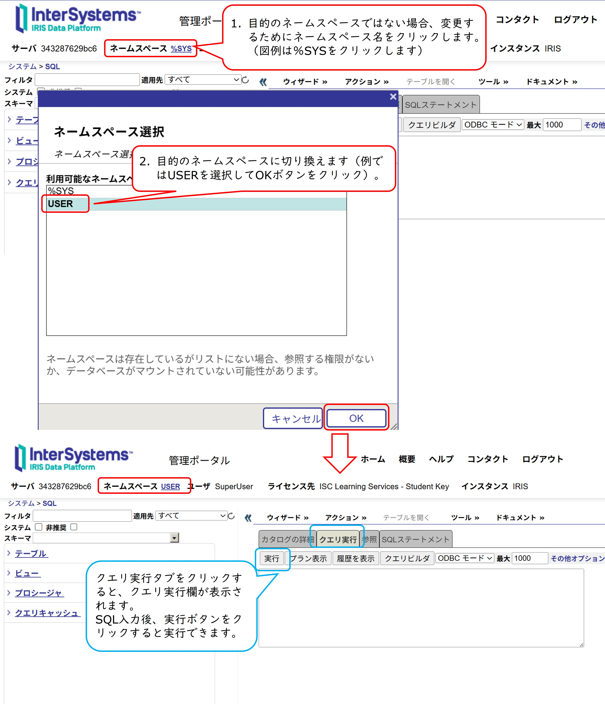

<div style="page-break-before: always;"></div>

### (3)患者情報テーブル作成～データ登録

患者情報（Training.Patient）テーブルをDDL文で作成します。

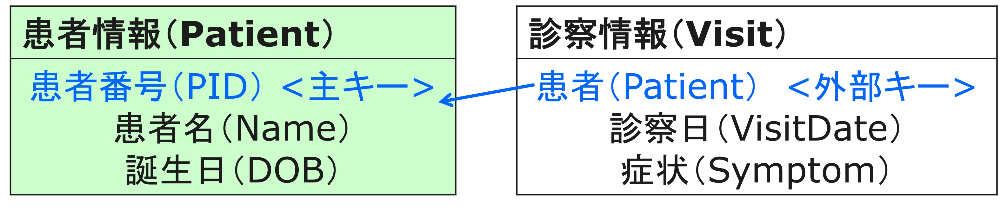

作成文例は、[/src/SampleTable.sql](./src/SampleTable.sql)にあります。ご参照ください。

### (4)診察情報テーブルの作成～データ登録

診察情報テーブル（Training.Visit）テーブルをDDLで作成します。

データ登録については、管理ポータルのインポート機能を試します。

管理ポータルのSQLメニューの[ウィザード]>[データインポート]を選択します。
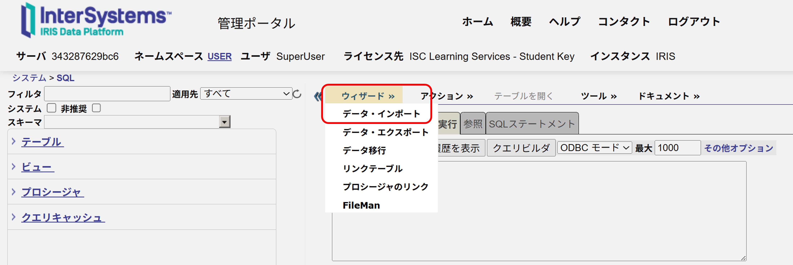

<div style="page-break-before: always;"></div>

インポートに使用するファイル：[VisitSample.txt](./data/VisitSample.txt)を選択します。

**サンプルファイルはUTF8で保存していますので、文字セットを「UTF8」に指定します。**

インポート対象テーブルのあるネームスペース（USER）、スキーマ名（Training）、テーブル名（Visit）を選択します。

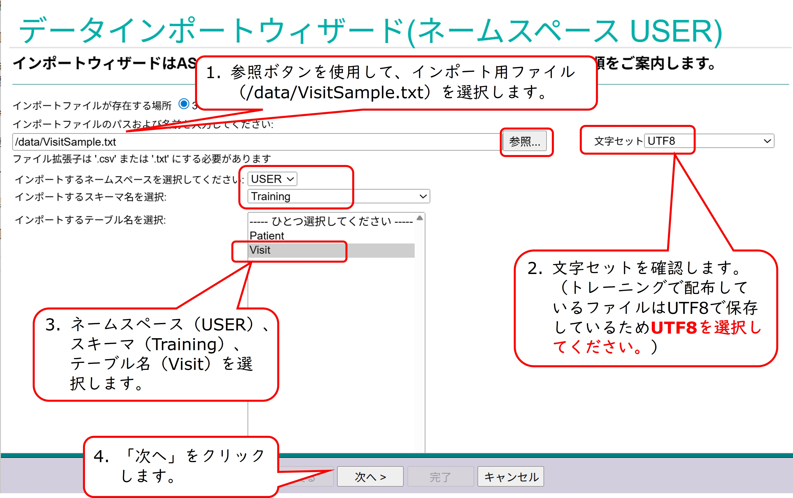

<div style="page-break-before: always;"></div>

次の画面では、インポート対象カラムを指定します（デフォルトで全カラムが選択されています）。

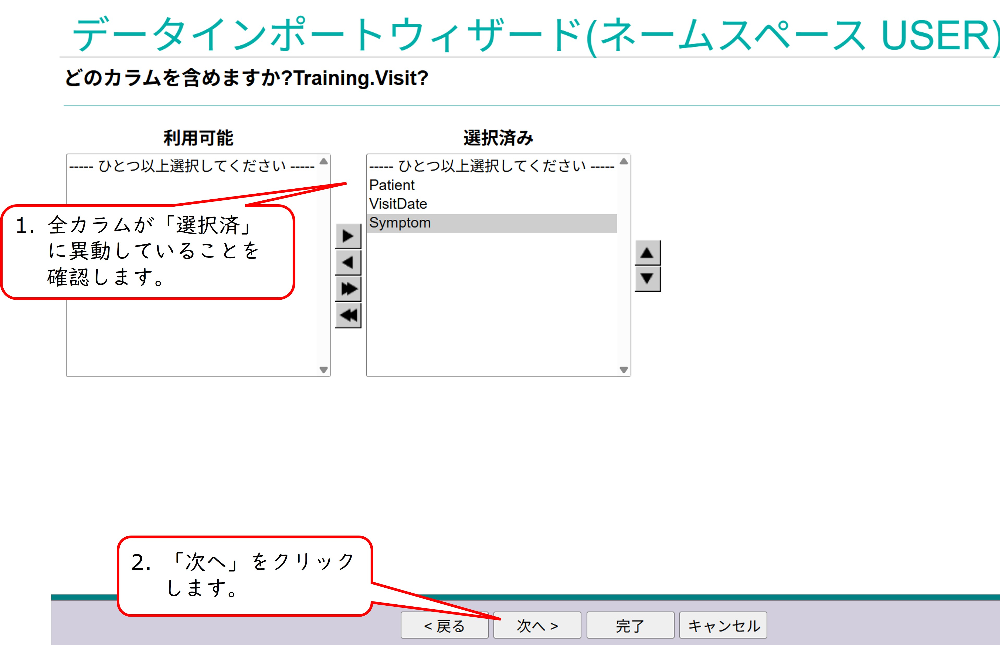

<div style="page-break-before: always;"></div>

次の画面では、区切り文字の選択、日付形式を正しい形式に選択します。

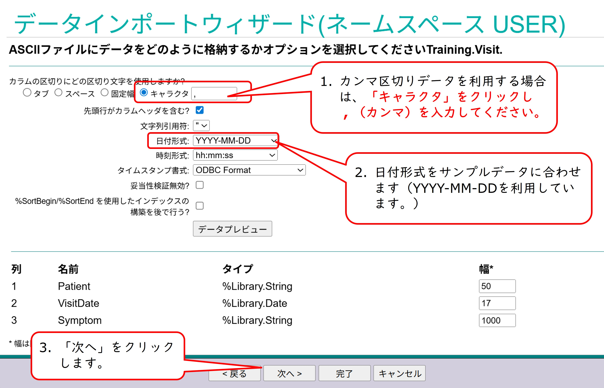

<div style="page-break-before: always;"></div>

次の画面では、指定項目の確認が表示されるので間違いがなければ、完了をクリックします。
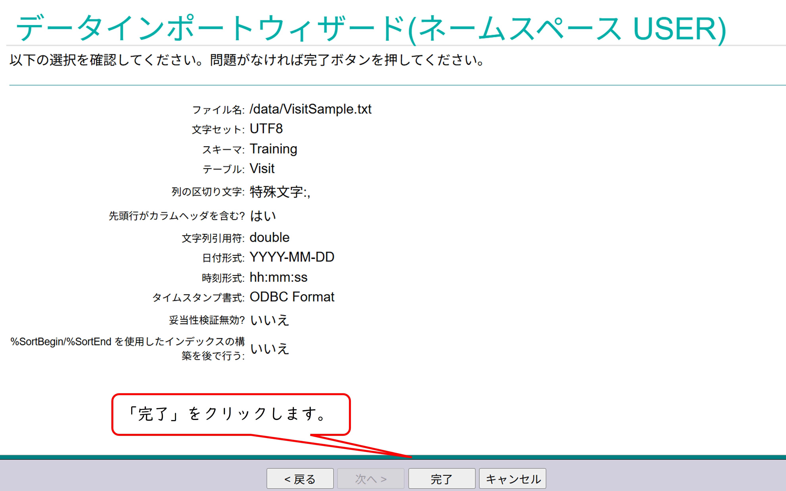

<div style="page-break-before: always;"></div>

バックグラウンドで実行されます。「バックグラウンドタスクページを参照するにはここをクリックしてください」のメッセージをクリックすると、別画面で状況確認が行えます。

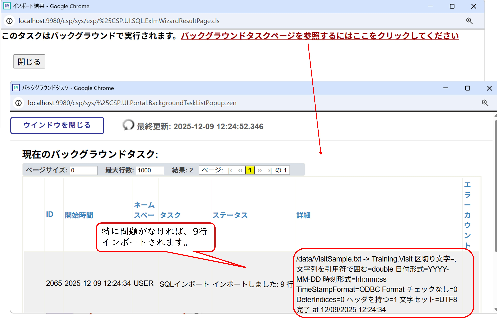


正常にインポートが完了すると9行インポートされます。

試しに、SELECT文を試します。

診察日付（VisitDate）別、症状別、来院患者数を確認します。
```
SELECT VisitDate,Symptom,Count(*) as VisitCountByDate
FROM Training.Visit
GROUP BY VisitDate
ORDER BY VisitDate Desc
```

<div style="page-break-before: always;"></div>

## 演習2：インデックスとチューニング

現在の使用状況を確認できるSQLの実行時統計情報にも含まれている「クエリプラン」の読み方を確認します。

また、インデックス定義前後でプランがどのように変わるのかも確認します。

最後に、インデックスの維持管理方法をサンプルテーブルを利用して確認します。

SQL文のコピー元：[IndexAndTuning.sql](./src/IndexAndTuning.sql) 

- [(1)事前準備（Training.Employeeの用意）](#1事前準備trainingemployeeの用意)
- [(2)クエリプランを参照する](#2クエリプランを参照する)
- [(3)選択性の計算](#3選択性の計算)
- [(4)CREATE INDEXのDEFERオプション](#4create-indexのdeferオプション)

<div style="page-break-before: always;"></div>

### (1)事前準備（Training.Employeeの用意）

演習で使用するテーブル：Training.Employee の作成とデータの作成を行います。

SQL文のコピー元：[IndexAndTuning.sql](./src/IndexAndTuning.sql) を開き、以下の指示以降にあるSQL文を管理ポータルで実行してください。

```
--- (1) インデックス確認用テーブル（Training.Employee）を作成
```
実行後、テーブル：`Training.Employee` が作成されます。

```
--- (2) データ一括消去用ストアドプロシージャ
```
実行後、ストアドプロシージャ：`Training.DeleteAll` が作成されます。

> 演習の中では使用予定はありませんが、データの再作成を行いたいときに利用できます。

```
--- (3) データ一括登録用ストアドプロシージャ（第1引数に追加したい件数を数値で入力します）
```
実行後、ストアドプロシージャ：`Training.CreateData()` が作成されます。

定義したストアドプロシージャ：`Training.CreateData()` を実行します。

引数に作成件数を指定できるので、`5000`を指定します。

<div style="page-break-before: always;"></div>

実行方法は下図の通りです。

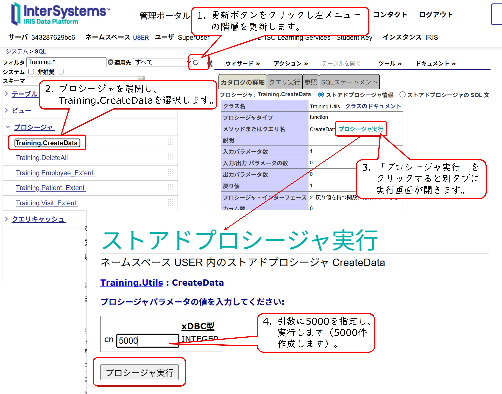

成功すると、「戻り値：1」と表示されます（実行が完了したらタブを閉じで大丈夫です）。

> 💡ご参考：SQLで実行する場合は、`CALL`文を利用します。
```
CALL Training.CreateData(5000)
```

続いて、データが正しく作成されたか確認します。

管理ポータルのクエリ実行欄に以下入力し、結果に5000と表示されるか確認します。

```
select count(*) from Training.Employee
```


<div style="page-break-before: always;"></div>

### (2)クエリプランを参照する

現在、デフォルトで用意されるインデックスとユニークインデックス以外、インデックスは定義されていないことを管理ポータルを利用して確認します。

管理ポータル > システムエクスプローラ > SQL > Training.Employee選択 > 右画面で「マップ/インデックス」を✅

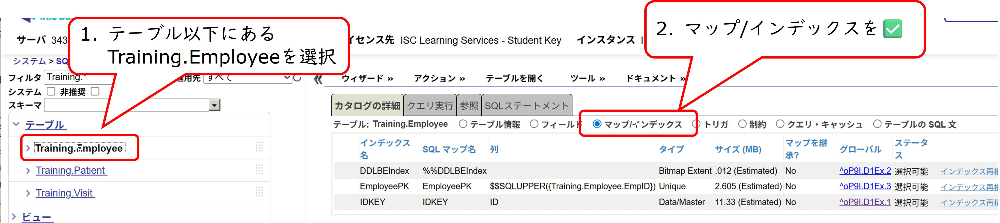

この状態で、以下クエリを実行します。

```
SELECT 
EmpID, Name, Dept, Location, Tel
FROM Training.Employee
Where Location = '北海道'
```
実行後、クエリ入力欄のすぐ下に表示される「行数」から「グローバル参照」までをメモします。

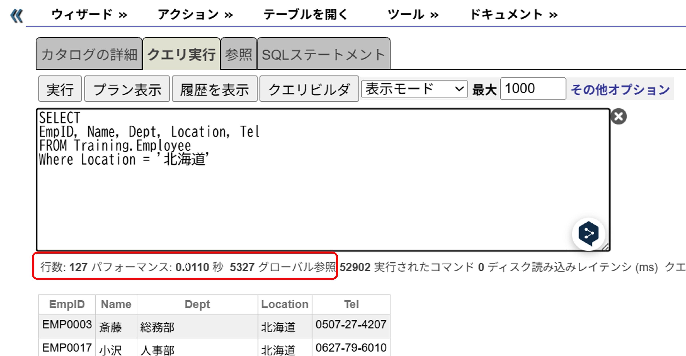

<div style="page-break-before: always;"></div>

次に、「プラン表示」ボタンをクリックします。

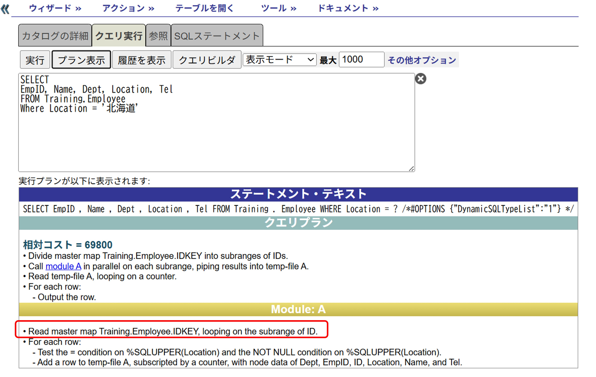

インデックスがないため、`master map` を参照し結果を表示していることがわかります（＝テーブルフルスキャンをしています）。

現在表示されている「相対コスト」をメモしてください。


<div style="page-break-before: always;"></div>

続いて、条件に指定されている `Location` に対してインデックスを定義します。

```
CREATE INDEX LocationIdx On Training.Employee(Location)
```

再度、クエリ実行ボタンをクリックし、「行数」から「グローバル参照」までをメモした後、「プラン表示」ボタンをクリックして、クエリプランを参照します。

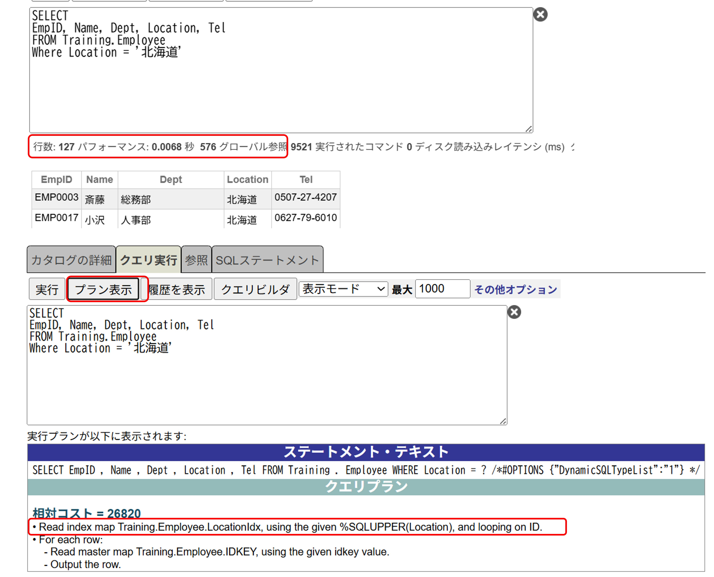

インデックスが使用されているでしょうか？

>💡ヒント：Read index map Training.Employee.LocationIdx～ から始まる行が表示されていると思います。この行がある＝追加したインデックスを使用して結果を取得したことを示しています。

この他、グローバル参照数と相対コストを比較すると、インデックス追加後に両方の値が減っていることを確認できます。

この結果から、インデックスを追加したほうが良いプランであることが確認できました。

<div style="page-break-before: always;"></div>

----

⌚ お時間ある場合は、以下のクエリに対してどのインデックスが利用されるか、確認してみてください。

最初は、以下クエリの実行でインデックスが使用されているかどうか「プラン表示」ボタンを利用して確認してください。

```
SELECT 
EmpID, Name, Dept, Location, Tel
FROM Training.Employee
Where Location = '北海道' AND Name %Startswith '山'
```

インデックス追加前のプランを確認した後で、以下インデックスを追加します。

```
--- (2) Nameに対する標準インデックスを定義する
CREATE INDEX NameIdx On Training.Employee(Name)
```
```
--- (3) LocationとNameに対する複合インデックスを定義する
CREATE INDEX NameLocationIdx On Training.Employee(Name,Location)
```

再度、SELECT文を実行し、プランを表示します。

どのインデックスが使用されたでしょうか？？


<div style="page-break-before: always;"></div>

### (3)選択性の計算

現在のテーブル：Training.Employeeの選択性数値はどうなっているでしょうか。

管理ポータルの以下メニューを利用して確認します。

**管理ポータル > SQL > Training.Employee選択 > [フィールド]を✅**

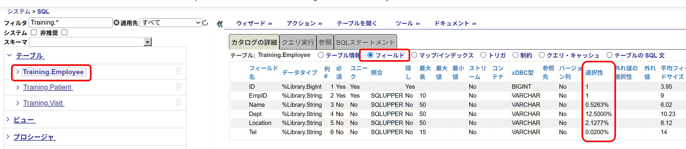

選択性数値が正しく入っているようです。

では、データ件数を増やして選択性数値に変化があるか確認します。

ストアドプロシージャ：Training.CreateData() を実行します。追加2000件作成したいので、引数に2000を指定します。

CALL文を利用する場合は、以下実行します。
```
CALL Training.CreateData(2000)
```
再度、選択性数値を確認します。

先ほどの結果を比べてどうでしょうか。変更ありましたか？

<div style="page-break-before: always;"></div>

別の画面で選択性数値の状態を確認してみます。

**Training.Employeeを選択した状態で > アクション > テーブルチューニング情報** を選択

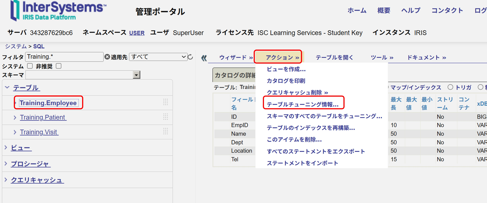

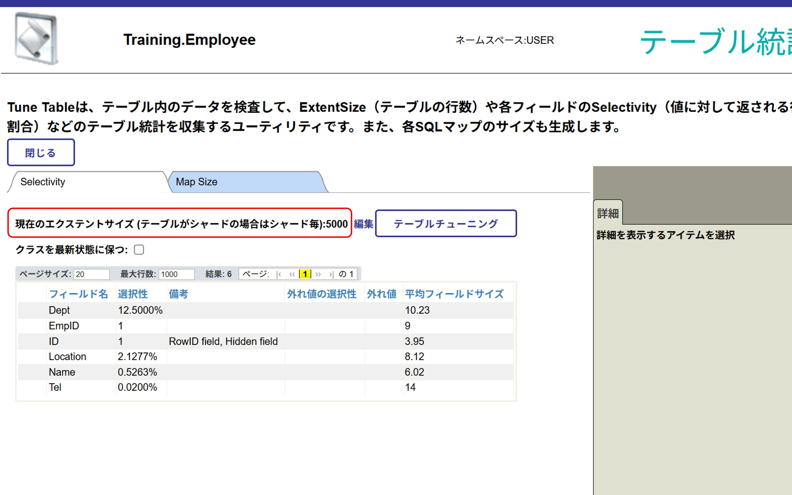

**「現在のエクステントサイズ（テーブルがシャードの場合はシャード毎）」** 右側の数値を確認します。

この値は現在のレコード総数と同じでしょうか？

データが増えた後、選択性数値は未計算のため古いレコード総数のままになっています。

> パフォーマンスが劣化していない場合はこのままの数値を利用するケースがほとんどです。


<div style="page-break-before: always;"></div>

試しに、「テーブルチューニング」ボタンをクリックし、再計算してみます。

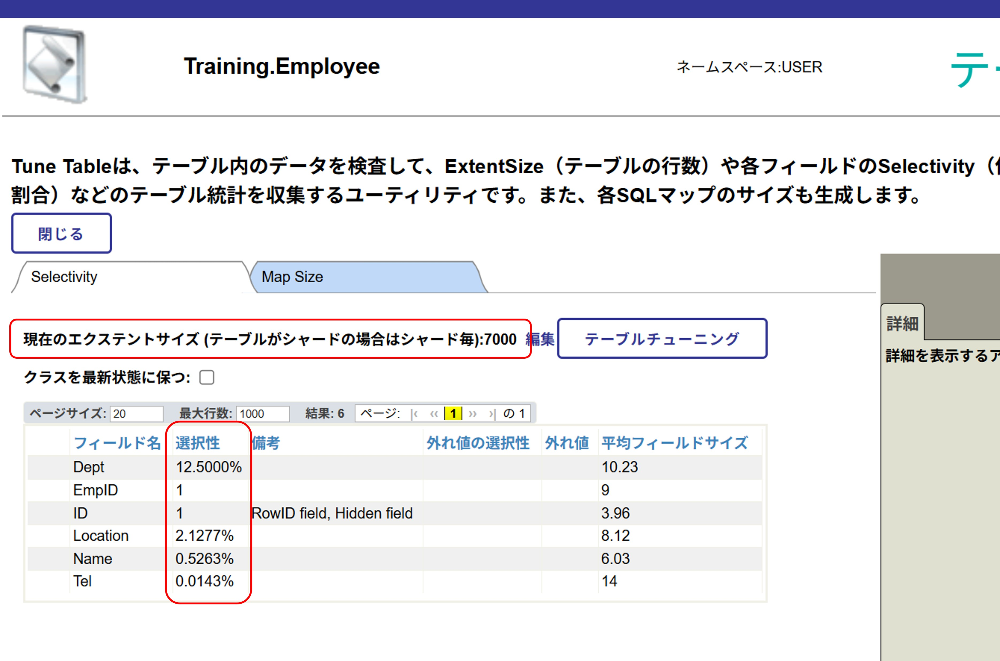

エクステントサイズが正しいレコード数に変わったことが確認できます。

> メモ：演習で使用しているデータはランダム生成のため、図解と異なる数値になる場合もあります。


**💡まとめ**

- 選択性数値は、一度も実行したことがないテーブルに対して最初のクエリを実行する時自動計算されますが、その後は手動で計算しない限り更新されません

- 選択性数値の計算が、データが存在しないテーブルに対して実行される場合、デフォルト値を設定するため、実際の値と合わない数値が設定されます。

- 選択性数値は、データの種類数が大幅に変わった場合や、パフォーマンスが以前より劣化した場合に実行します。


<div style="page-break-before: always;"></div>

### (4)CREATE INDEXのDEFERオプション

CREATE INDEX文を実行すると、インデックス追加と既存データに対するインデックス再構築が同時に実行されます。

膨大なレコード数のテーブルに対して管理者が指定する時刻にインデックス再構築を実行したい場合、**CREATE INDEXのDEFERオプション**を使用してインデックス定義を行い、任意のタイミングで**BUILD INDEX文を使用してインデックス再構築を命令することができます。**

この演習では、DEFERオプションによりインデックスが**選択不可能**になっていること、BUILD INDEXの実行により、自動的にインデックスが**選択可能**になることを確認します。

現時点で、LocationIdxが定義されているので、一旦削除します。

```
DROP INDEX %NOJOURN LocationIdx ON Training.Employee
```

以下のSELECT文を管理ポータルのクエリ入力欄に指定し、「プラン表示」ボタンクリックします。

現時点ではインデックスが使用されないプランであることを確認します。
```
SELECT 
EmpID, Name, Dept, Location, Tel
FROM Training.Employee
Where Location = '北海道'
```
> ヒント：`Read master map Training.Employee.IDKEY, looping on the subrange of ID.` と表示されていれば、インデックス未使用のプランに変わっています。

DEFERオプションを付けたCREATE INDEX文を実行します。
```
CREATE INDEX LocationIdx On Training.Employee(Location) DEFER
```

実行後、管理ポータルでTraining.Employeeテーブルに対する「マップ/インデックス」の表示を確認します。

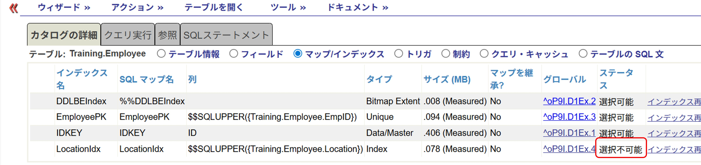

**「選択不可能」** と表示されていることを確認出来たら、再度同じSELECT文を「プラン表示」ボタンで確認し、まだLocationIdxが使用されていないことを確認します。

<div style="page-break-before: always;"></div>


次に、BUILD INDEXを実行し、インデックス再構築を命令します。

実行終了と同時に `LoxationIdx` が **「選択可能」** に変わるため、同じSELECT文のクエリプランが `LocationIdx` を使用するプランに変わることを確認します。

```
BUILD INDEX FOR TABLE Training.Employee INDEX LocationIdx
```
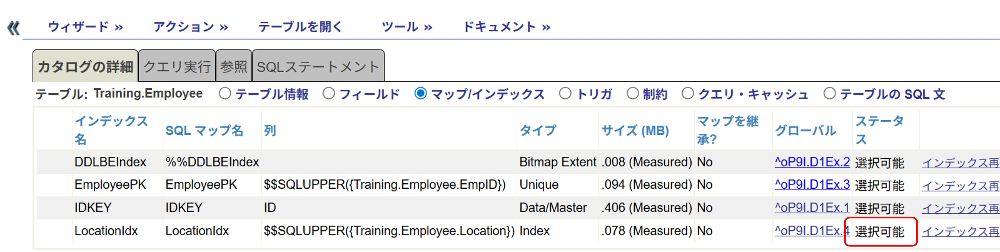

同じSELECT文のクエリプランを表示します。

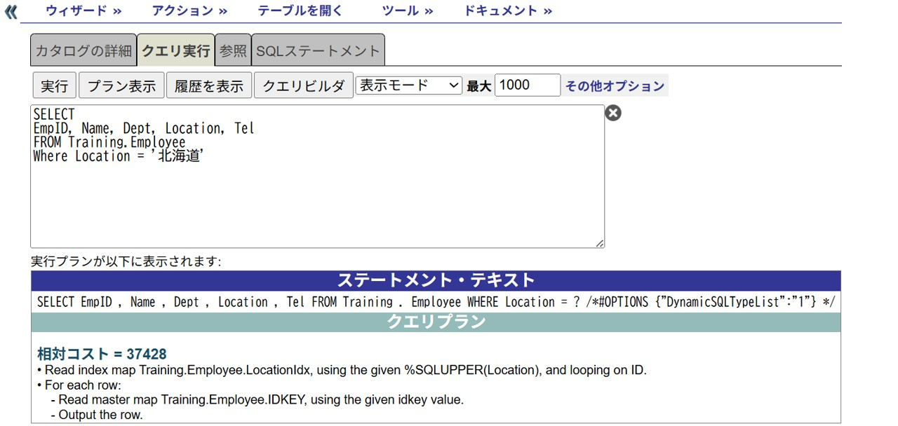

`LocaionIdx` を利用するプランに変わったでしょうか？

<div style="page-break-before: always;"></div>

## 演習3：VB.NETからアクセスする

サンプルは、[ConsoleApp1](./ConsoleApp1/) にあります。

> Visual Studio2019で作成したコンソールアプリケーションです。

VB.NETからODBC接続でIRISに接続し、テーブルから情報を取得する流れを試す手順を解説します。


- [(1)ODBC接続のための準備](#1odbc接続のための準備)
- [(2)プロジェクト作成までの手順](#2プロジェクト作成までの手順)
- [(3)サンプルコード](#3サンプルコード)

### (1)ODBC接続のための準備

IRISにODBC接続するため、ODBCデータソースを作成します。

Windowsの検索窓で **odbc** を検索し、**ODBC データソース（64ビット）** を選択します。

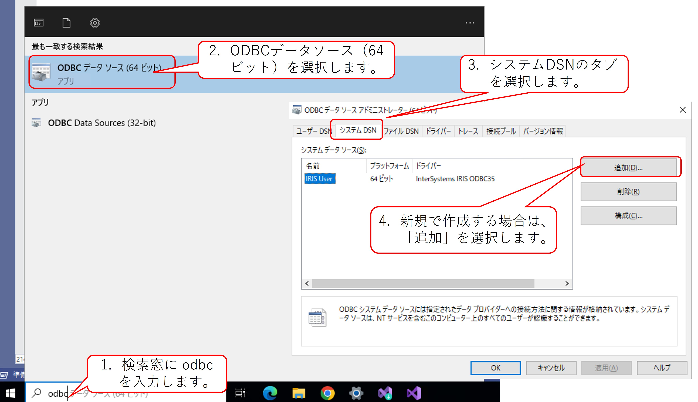

<div style="page-break-before: always;"></div>


**システムDSNタブ**に切り換え、IRIS用ドライバを利用してデータソースを作成します。

例では以下の内容を設定しています。

データソースの名称|ホスト（IPアドレス）|ポート|ネームスペース|ユーザ名|パスワード
--|--|--|--|--|--
Test|127.0.0.1<br>デフォルトのまま|1972<br>デフォルトのまま|USER<br>デフォルトのまま|SuperUser|インストール時設定したパスワード

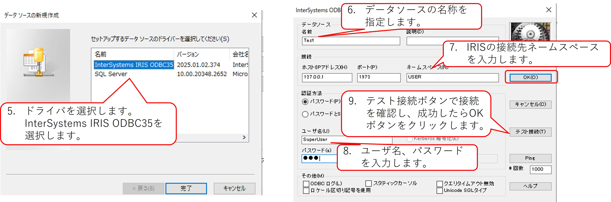

<br>

### (2)プロジェクト作成までの手順

Visual Studioを立ち上げて、VB.NETのコンソールアプリケーションのプロジェクトを新規で作成します。

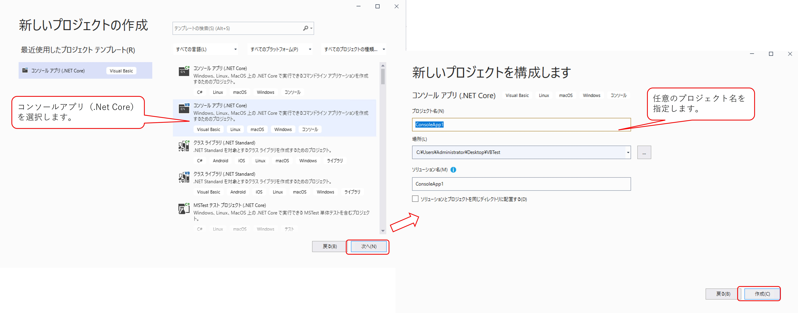

<div style="page-break-before: always;"></div>

続いて、プロジェクトにODBCの接続に必要な参照を追加します。

**プロジェクト > NuGetパッケージの管理** から **System.Data.Odbc** のバージョン **4.7.0** を指定してインストールします。

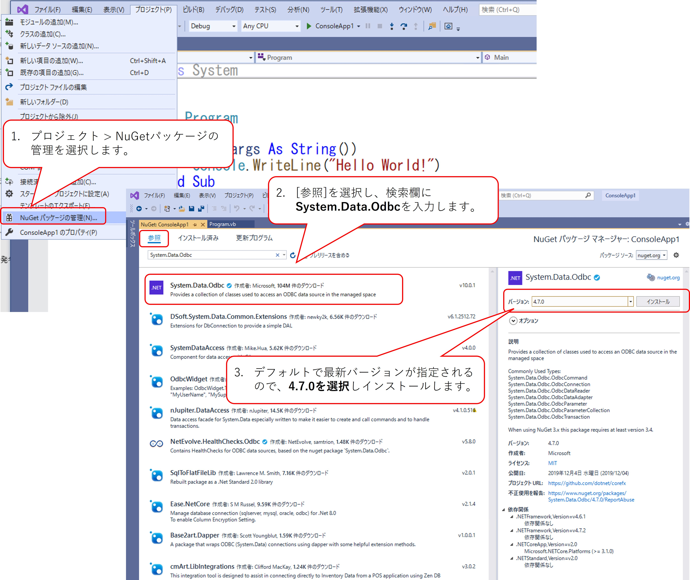


<div style="page-break-before: always;"></div>


### (3)サンプルコード

作成したプロジェクト内Program.vbを修正します。

> サンプルは、[ConsoleApp1](./ConsoleApp1/) にあります。

ODBC接続のため、以下ネームスペースをインポートします。

```
Imports System.Data.Odbc
```
IRISへODBC接続するための接続オブジェクトを作成します。
```
Dim conn As OdbcConnection = New OdbcConnection("DSN=Test")
```
>DSNに設定するのデータソース名は、[(1)ODBC接続のための準備](#1odbc接続のための準備) で作成したデータソース名を指定してください。

次に、実行するSELECT文を変数にセットします。

例）
```
Dim SelectSQL As String = "SELECT VisitDate,Symptom,Count(*) as VisitCountByDate
                           FROM Training.Visit
                           GROUP BY VisitDate
                           ORDER BY VisitDate Desc"
```

IRISへの接続を開始します。
```
conn.Open()
```
DataReaderを利用して検索を開始するために、OdbcCommandオブジェクトを作成し、実行対象のSELECT文（SelectSQL）を設定します。
```
Dim cmd As OdbcCommand = New OdbcCommand(SelectSQL, conn)
```
OdbcCommandクラスのExecuteReader()メソッドを利用してSQL文を実行し、実行結果をDataReaderオブジェクトに格納します。
```
Dim DataReader As OdbcDataReader = cmd.ExecuteReader()
```

DataReaderのRead()メソッドを使用して結果を取得します。移動行がなくなると0（偽）を返します。

カラム値はSQL文で指定した列名、またはエイリアス名を使用して取得します。

```
While DataReader.Read()
    Console.WriteLine("{0},{1},{2} ", DataReader("VisitDate"), DataReader("Symptom"), DataReader("VisitCountByDate"))
End While
```

以上で演習は終了です。

お疲れ様でした！